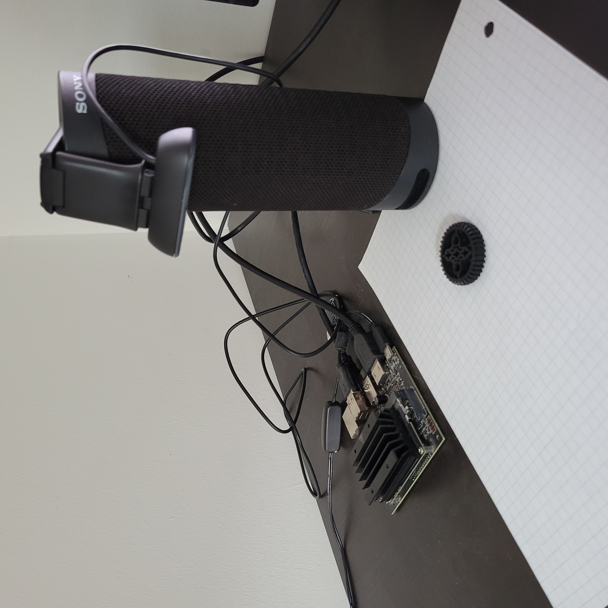

# Lego Sorter
Image classification of Lego pieces into sortable categories.

## Description
This system constitutes the first step of an autonomous Lego Technic piece sorter. The pieces are photographed and processed by an image classification neural network in real time, being classified into categories such as beam, peg, gear, axle, etc. Then, a mechanical component can transfer the piece to the correct container.

## Background
One of the main efficiency losses in First Lego League teams is the time spent looking for pieces. This can be minimized through careful sorting of pieces when taking apart old builds, but this also takes up time, and plus, no one wants to do it. The Jetson Nano system, in combination with a trivial robot, will be able to sort pieces into many discrete categories at a faster rate than humans without exceeding their error rate.

## Hardware Requirements
Jetson Nano

Jetson Nano compatible camera (USB camera recommended)

## Setup

Camera stand (a simple DYI cardboard one will work well)

Recommended: white grid background (graph paper). In testing this improved the accuracy of the model by providing a reference point for individual piece size.



## Installation
### Install needed dependencies
JetCam for camera interface
```
https://github.com/NVIDIA-AI-IOT/jetcam
```
Pytorch and Torchvision to run the neural network
```
https://qengineering.eu/install-pytorch-on-jetson-nano.html
```


### Clone repository
```
$ git clone https://github.com/Launfal501/legosorter.git
```

### Navigate to directory
```
$ cd legosorter
```

### Run the code
```
$ python3 main.py
